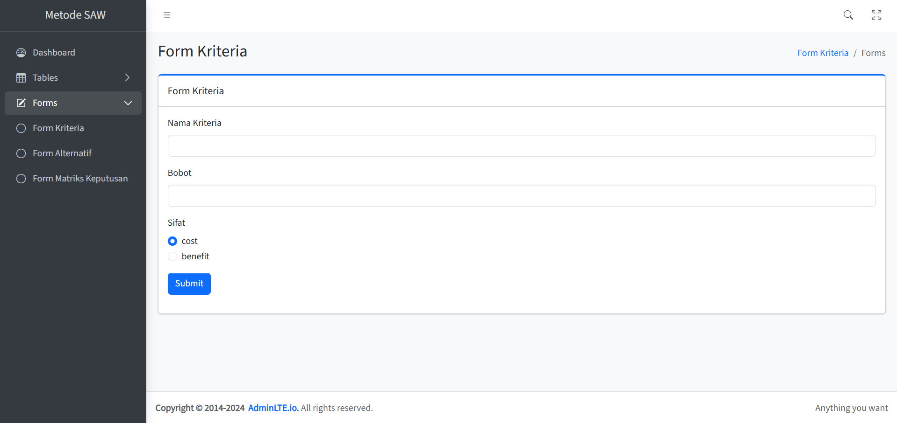
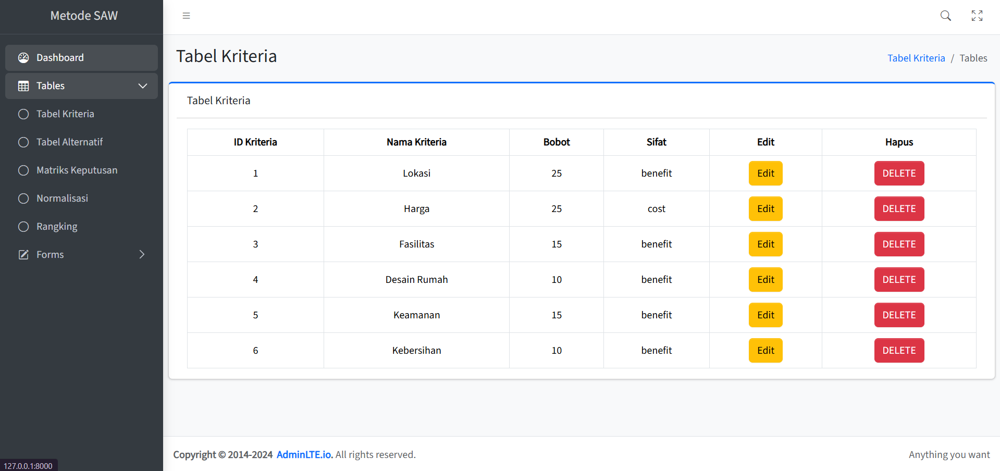
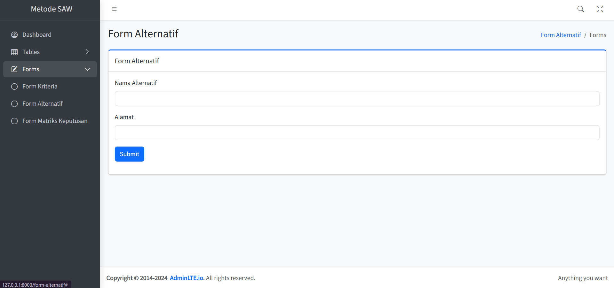
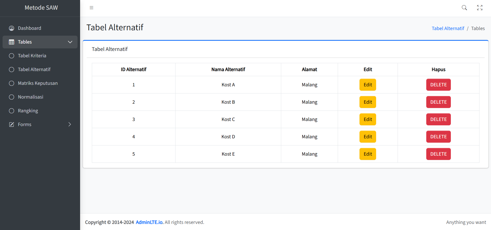
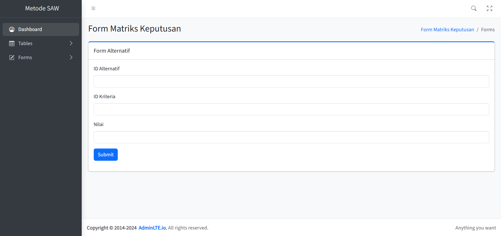
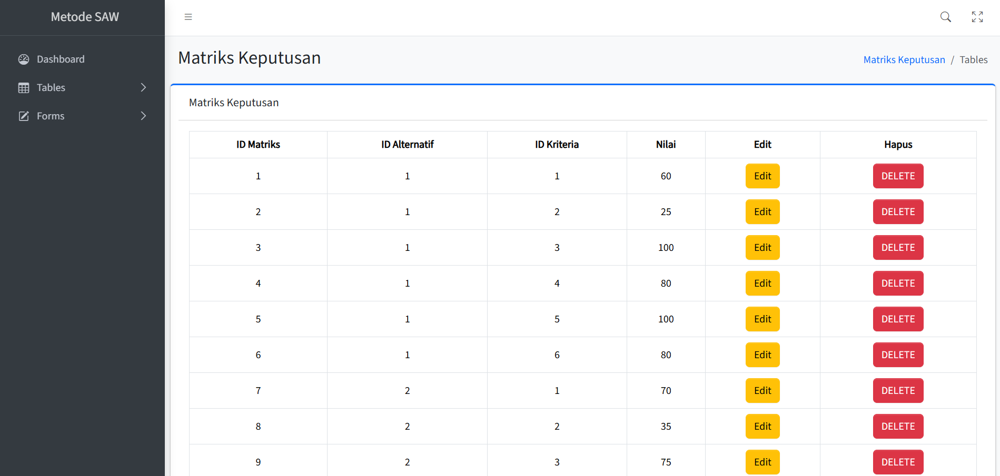
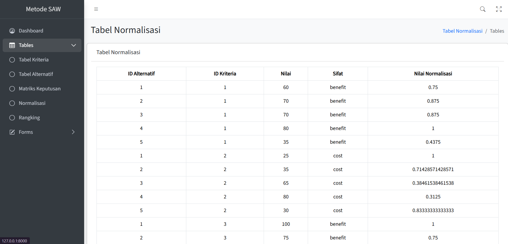
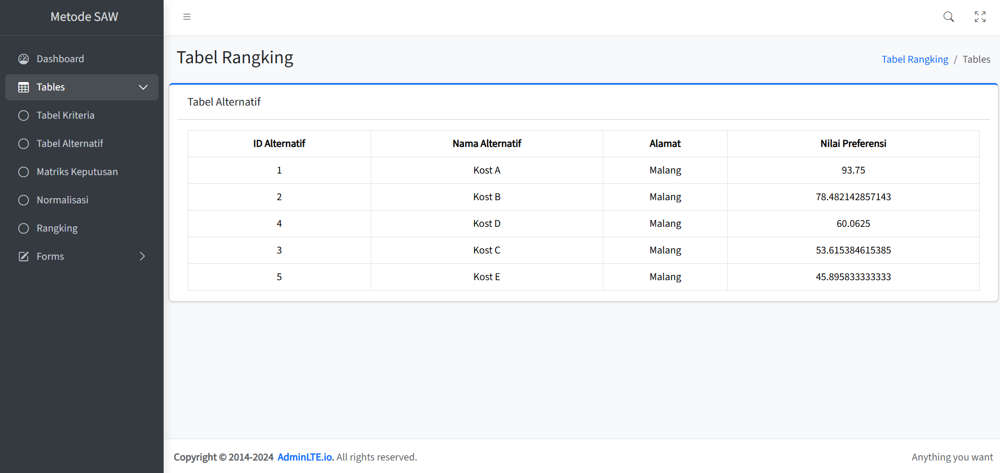

## About This Project

A simple rental housing decision support system that is customizable to meet user needs.

## How to use

- Input the criteria in form kriteria

Your criteria will appear in the criteria table where you can check them there.

- Input the alternative in form alternatif

Your alternatuf will appear in tabel where you can check them there.

- Input the decision matrix in form matriks keputusan

Fill in ID Alternatif with the ID of the alternative you wish to score, ID Kriteria with the ID of the criterion used as the basis for the evaluation, and nilai with the specific score assigned to that alternative.

For example, if you want to input a value for Kos A based on its Lokasi, you would enter 1 (the ID for Kos A) into the ID Alternatif column, 1 (the ID for Lokasi) into the ID Kriteria column, and your desired score into the nilai column.

Your inputed decision matrix will appear in the decision matrix table where you can check them there.

## Output

- The normalization of the matrix will appear in tabel normalisasi

- The ranking for each alternative will appear in tabel rangking

